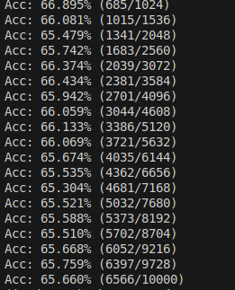

# VITTrying
## 文件结构
- VITTrying \
|- model.py(模型结构) \
|-README.md \
|-run.py(测试准确率) \
|-train.py(模型训练) \
|-data\ (cifar10数据集文件夹)
## 文件详情
- ./data是cifar10数据集文件夹，跑train.py自动下载
- model.py是VIT模型文件
- train.py用于训练VIT模型
- run.py用于测试训练出模型的准确率
- 使用python train.py进行训练(模型参数可更改)，使用python run.py进行准确率验证
## 相关问题
- 目前10轮训练下准确率只有64%左右，由于cifar10数据集太小、像素低和VIT的固有缺陷导致准确率不高
